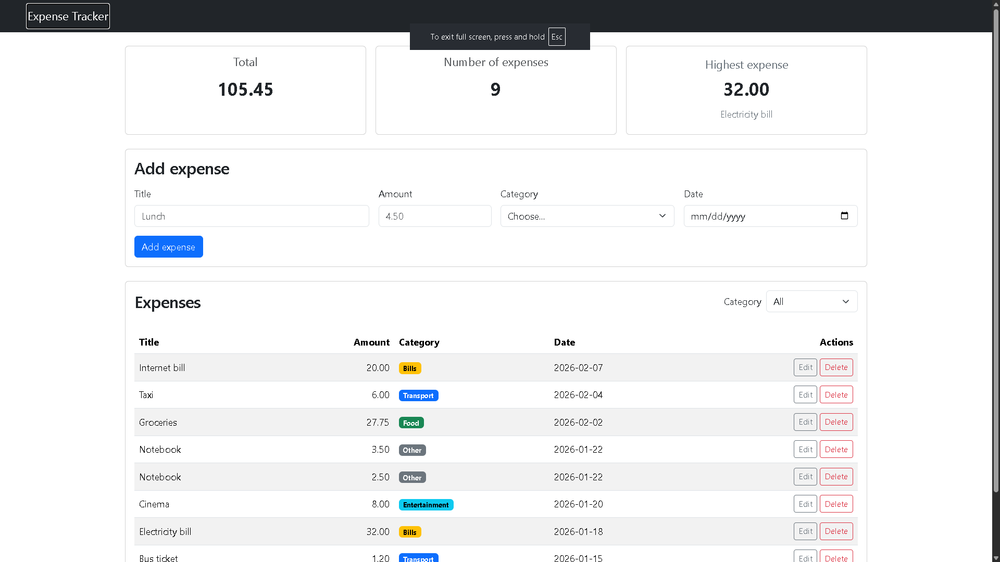
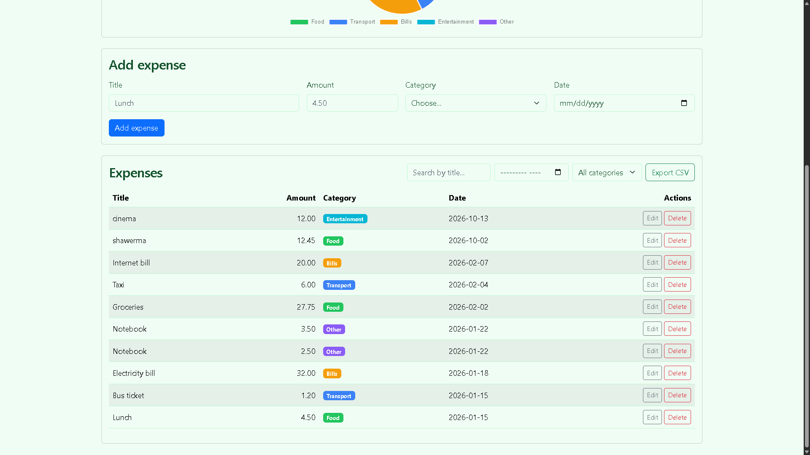
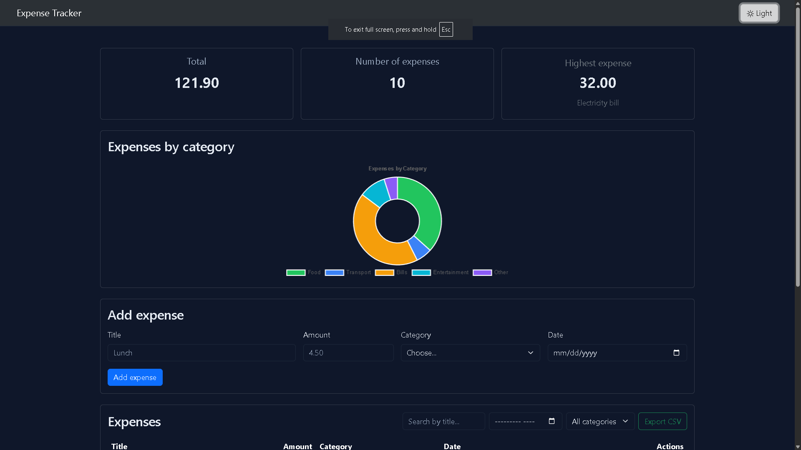
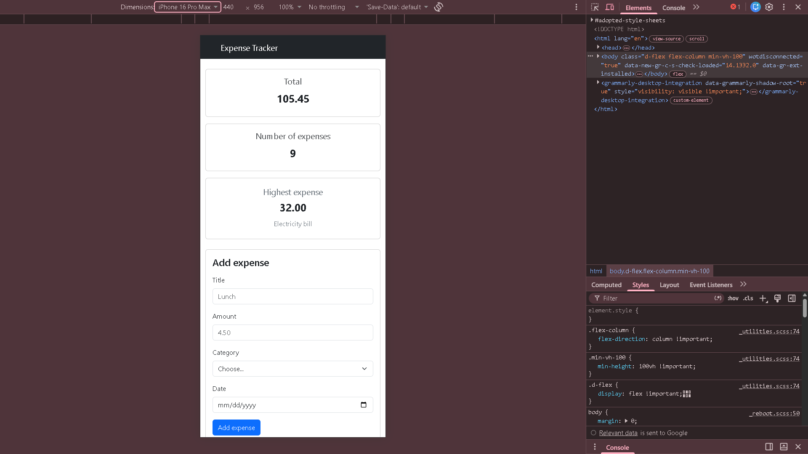
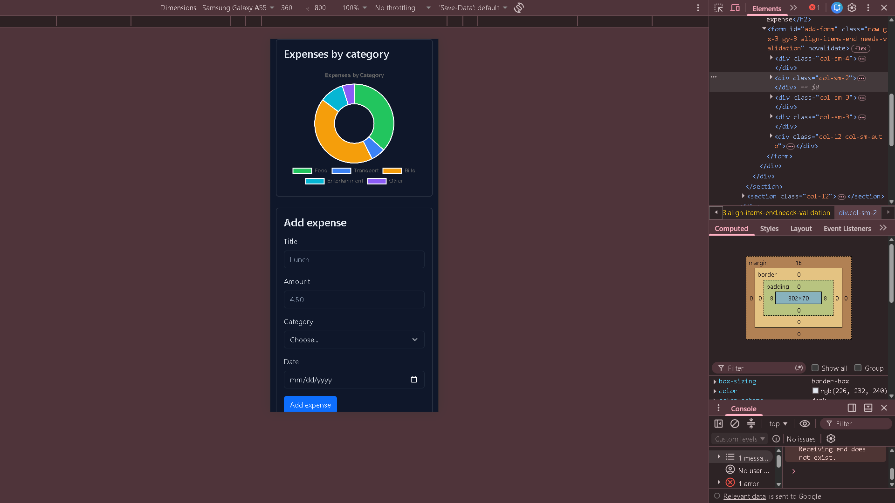
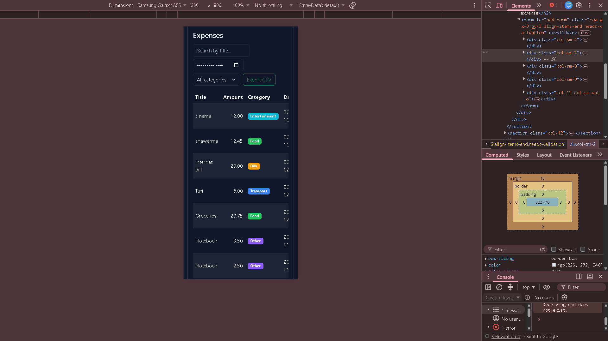

# Expense Tracker

A full-stack web application that lets you track personal expenses.  
You can add, edit, delete, filter, search, sort and export expenses.  
The data is stored in a PostgreSQL database and served through a Node.js + Express API.

---

## Demo

🔗 **Live Demo / Video:**  
[https://drive.google.com/file/d/1z0sKO6wA3PaTbNDJBctYmY-WlVIGAy1g/view?usp=sharing]


---

## Screenshots

### Desktop - Light Mode


### Desktop - Light Mode - Table


### Desktop - Dark Mode


### Desktop - Dark Mode -Table


### Mobile View



### Mobile Table



---

## Features

### Required Features
- [x] Add an expense (with validation)
- [x] Delete an expense
- [x] Edit an expense (in a Bootstrap modal)
- [x] Filter by category
- [x] Summary cards (total, count, highest expense)
- [x] Data is saved in a PostgreSQL database
- [x] Loading spinner
- [x] Error alerts (including when the server is down)
- [x] CSS Grid for summary cards
- [x] Responsive design

### Bonus Features
- [x] Dark Mode toggle (saves preference in localStorage)
- [x] Chart.js doughnut chart (expenses by category)
- [x] Search by title
- [x] Filter by month
- [x] Sortable table (click any column header)
- [x] Export expenses as CSV

---

## How to run

### Backend

1. Create a PostgreSQL database named `expense_tracker`.
2. Run the file `backend/schema.sql` on that database (it creates the table and inserts sample data).
3. Copy `backend/.env.example` to `backend/.env` and write your PostgreSQL password:
   ```
   DB_HOST=localhost
   DB_USER=postgres
   DB_PASSWORD=your_password_here
   DB_NAME=expense_tracker
   PORT=3000
   ```
4. Open a terminal in the `backend` folder and install the packages:
   ```bash
   npm install
   ```
5. Start the server:
   ```bash
   node server.js
   ```
   You should see: `Server running on http://localhost:3000`

### Frontend

1. Open the `frontend` folder with VS Code.
2. Right-click `index.html` → “Open with Live Server”  
   (or use any static server).
3. The page will load at `http://127.0.0.1:5500` (or similar).  
   Make sure the backend is still running.

---

## Project Structure

```
expense-tracker/
├── frontend/
│   ├── index.html
│   ├── css/style.css
│   └── js/app.js
├── backend/
│   ├── server.js
│   ├── package.json
│   ├── schema.sql
│   └── test-screenshots/
├── images/               
└── README.md
```

---

## Tech Stack

- **Frontend:** HTML, CSS, JavaScript, Bootstrap 5, Chart.js
- **Backend:** Node.js, Express
- **Database:** PostgreSQL

---

## What was the hardest part?

The hardest part was connecting the front-end forms and the modal to the real API with `fetch` and `async/await`, especially handling validation on both the client and the server, and making sure the table and summary cards always stay in sync after every add, edit or delete.  
Once the pattern of “send request → refresh from the server” was clear, the rest became much easier.

---

## Author

Omar salah mohammad shilbaya
Dalil Academy – Full Stack Web Development

